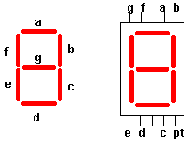
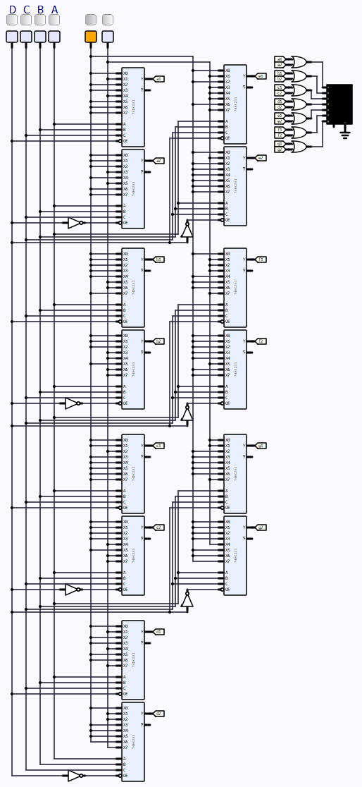

# **Diseño de decodificador BCD a 7 segmentos**

## **Con compuertas lógicas**

Para crear el circuito combinacional requerido para el decodificador, de 0 al 9, se requiere conocer la forma de un bcd de 7 segmentos y posteriormente realizar las tablas de verdad.

El BCD de 7 segmentos se muestra a continuación:

Para realizar la cuenta del 0 al 9, se requieren 4 bits (0 - 15), por lo que ka tabla de verdad queda de la siguiente forma considerando todas las combinaciones de los bits de entrada (con la siguiente forma: DCBA) y los segmentos correspondientes que se deben encender para que el BCD muestre el número indicado.

|**Valor**|**D**|**C**|**B**|**A**|**a**|**b**|**c**|**d**|**e**|**f**|**g**|
|:-:|:-:|:-:|:-:|:-:|:-:|:-:|:-:|:-:|:-:|:-:|:-:|
|0  |0  |0  |0  |0  |1  |1  |1  |1  |1  |1  |0  |
|1  |0  |0  |0  |1  |0  |1  |1  |0  |0  |0  |0  |
|2  |0  |0  |1  |0  |1  |1  |0  |1  |1  |0  |1  |
|3  |0  |0  |1  |1  |1  |1  |1  |1  |0  |0  |1  |
|4  |0  |1  |0  |0  |0  |1  |1  |0  |0  |1  |1  |
|5  |0  |1  |0  |1  |1  |0  |1  |1  |0  |1  |1  |
|6  |0  |1  |1  |0  |1  |0  |1  |1  |1  |1  |1  |
|7  |0  |1  |1  |1  |1  |1  |1  |0  |0  |0  |0  |
|8  |1  |0  |0  |0  |1  |1  |1  |1  |1  |1  |1  |
|9  |1  |0  |0  |1  |1  |1  |1  |0  |0  |1  |1  |
|10 |1  |0  |1  |0  |X  |X  |X  |X  |X  |X  |X  |
|11 |1  |0  |1  |1  |X  |X  |X  |X  |X  |X  |X  |
|12 |1  |1  |0  |0  |X  |X  |X  |X  |X  |X  |X  |
|13 |1  |1  |0  |1  |X  |X  |X  |X  |X  |X  |X  |
|14 |1  |1  |1  |0  |X  |X  |X  |X  |X  |X  |X  |
|15 |1  |1  |1  |1  |X  |X  |X  |X  |X  |X  |X  |

Una vez realizado la tabla de verdad, se proceden a hacer los mapas K de las 7 funciones correspondientes a cada segmento.

- Simplificación para a: 
    
    Con los ceros del mapa K, se realiza la simplifación con POS:
        
    a = (A + B + C' + D)(A' + B + C + D)

- Simplificación para b:

    b = A'B' + AB + C' = A xnor B + C'

- Simplificación para c:

    c = A + B' + C + D

- Simplificación para d:

    d = A'C' + A'B + BC' + AB'C

- Simplificación para e:

    e = (A')(B + C')

- Simplificación para f:

    f = (A' + B')(B' + C)(A' + C + D)

- Simplificación para g:

    g = D + B'C + A'B + BC'

Ahora con las funciones para cada segmento, se muestra la implementación del diagrama lógico:

Funcionamiento:

## **Compuerta universal NAND**

Para implementar el decodificador con compuertas universales NAND, se requiere que las funciones de los segmentos estén en suma de productos (SOP) o de minitérminos:

    a = A'C' + B + D + AC
    b = AB + A'B' + C'
    c = B' + AD' + BC
    d = A'C' + A'B + BC' + AB'C
    e = A'C' + A'B
    f = A'C + A'B' + B'C + D
    g = D + B'C + A'B + BC'

Para encontrar las formas NAND, se negará cada función dos veces para dejarla de forma visual tal que permita realizar el diagrama lógico correcto:

    a = (A'C' + B + D + AC)'' = [(A'C')'B'D'(AC)']'
    b = (AB + A'B' + C')'' = [(AB)'(A'B')'C]'
    c = (B' + AD' + BC)'' = [B(AD')'(BC)']'
    d = (A'C' + A'B + BC' + AB'C)'' = [(A'C')'(A'B)'(BC')'(AB'C)']'
    e = (A'C' + A'B)'' = [(A'C')'(A'B)']'
    f = (A'C + A'B' + B'C + D)'' = [(A'C)'(A'B')'(B'C)D']' 
    g = (D + B'C + A'B + BC')'' = [D'(B'C)'(A'B)'(BC')']'

La construcción del diagrama lógico se muestra a continuación:

Funcionamiento:

## **Compuerta universal NOR**

Para implementar el decodificador con compuertas universales NOR, se requiere tener las funciones de cada segmento en forma de producto de sumas (POS) o en maxitérminos:

    a = (A + B + C' + D)(A' + B + C + D)
    b = (A' + B + C' + D)(A + B' + C' + D)
    c = (A + B' + C + D)
    d = (A + B + C' + D)(A' + B' + C' + D)(A' + B + C)
    e = (A')(B + C')
    f = (A' + B')(B' + C)(A' + C + D)
    g = (B + C + D)(A' + B' + C')

Una vez obtenidas las funciones en forma POS se realiza el complemento dos veces para obtener las formas NOR requeridas:

    a = [(A + B + C' + D)' + (A' + B + C + D)']'
    b = [(A' + B + C' + D)' + (A + B' + C' + D)']'
    c = [(A + B' + C + D)']'
    d = [(A + B + C' + D)' + (A' + B' + C' + D)' + (A' + B + C)']'
    e = [A + (B + C')']'
    f = [(A' + B')' + (B' + C)' + (A' + C + D)']'
    g = [(B + C + D)' + (A' + B' + C')']'

El diagrama lógica de compuertas universales NOR se muestra a continuación:

Funcionamiento:

## **Diseño con decodificadores**

Para el desarrollo del circuito combinacional se procederá a usar 2 decodificadores de 3 canales de selección, usando el ENABLE como la cuarta línea de selección; para poder tener la tabla de verdad mejor definida, se modificará para que la cuenta sea de 0 a 9 y después de A a F.

|**Valor**|**D**|**C**|**B**|**A**|**a**|**b**|**c**|**d**|**e**|**f**|**g**|
|:-:|:-:|:-:|:-:|:-:|:-:|:-:|:-:|:-:|:-:|:-:|:-:|
|0  |0  |0  |0  |0  |1  |1  |1  |1  |1  |1  |0  |
|1  |0  |0  |0  |1  |0  |1  |1  |0  |0  |0  |0  |
|2  |0  |0  |1  |0  |1  |1  |0  |1  |1  |0  |1  |
|3  |0  |0  |1  |1  |1  |1  |1  |1  |0  |0  |1  |
|4  |0  |1  |0  |0  |0  |1  |1  |0  |0  |1  |1  |
|5  |0  |1  |0  |1  |1  |0  |1  |1  |0  |1  |1  |
|6  |0  |1  |1  |0  |1  |0  |1  |1  |1  |1  |1  |
|7  |0  |1  |1  |1  |1  |1  |1  |0  |0  |0  |0  |
|8  |1  |0  |0  |0  |1  |1  |1  |1  |1  |1  |1  |
|9  |1  |0  |0  |1  |1  |1  |1  |0  |0  |1  |1  |
|10 |1  |0  |1  |0  |1  |1  |1  |0  |1  |1  |1  |
|11 |1  |0  |1  |1  |0  |0  |1  |1  |1  |1  |1  |
|12 |1  |1  |0  |0  |1  |0  |0  |1  |1  |1  |0  |
|13 |1  |1  |0  |1  |0  |1  |1  |1  |1  |0  |1  |
|14 |1  |1  |1  |0  |1  |0  |0  |1  |1  |1  |1  |
|15 |1  |1  |1  |1  |1  |0  |0  |0  |1  |1  |1  |

Con la tabla anterior, se observa que conviene usar los maxitérminos pues están en menor medida que los minitérminos, por lo que en la entrada de cada segmento se implementarán compuertas NOR en lugar de compuertas OR (esto si se usaran los minitérminos). El diagrama lógico resultante se muestra a continuación:

Funcionamiento:

## **Diseño con multiplexores**

### **Multiplexores 8 a 1**

Se realiza la implementación del circuito combinacional mediante multiplexores 8 a 1, puesto que cada segmento tiene 16 opciones, se implementan 2 mux cuyas salidas van a una or a la entrada de cada segmento del display.

### **Multiplexores 4 a 1, de 0 a 9**

Para implementar el diseño por mux'es 4 a 1, se requiere consultar de nuevo cada mapa k de cada segmento. Para esta implementación se establecerá a las variables C y D como los selectores, y para A y B, serán determinadas sus funciones. Se hará uso de los minitérminos en este ejemplo.

La implementación lógica se muestra a continuación:

Funcionamiento:

### **Multiplexores 4 a 1, de 0 a 9 y luego de A a F**

Para la implementación de este circuito, ahora se retomarán a C y D como selectores pero ahora usando a A y B como funciones de maxitérminos. Se muestran los mapas K completos y las funciones correspondientes que irán a las línes de entrada de los multiplexores.

Ahora se muestra la implementación del diagrama lógico con multiplexores 4 a 1.

Funcionamiento:

## **Diseño con memorias**

Para llevar a cabo el diseño con memorias, se debe modificar la tabla para agregar una variable más, y se cambiará el orden de las variables para que se vea mejor expuesta en el simulador. El tamaño de la palabra será de 8 y 4 datos (se manejarán expansiones).

### **Memoria de 16x8**

|**Valor**|**D**|**C**|**B**|**A**|**h**|**g**|**f**|**e**|**d**|**c**|**b**|**a**|**Hex**|**Dec**|
|:-:|:-:|:-:|:-:|:-:|:-:|:-:|:-:|:-:|:-:|:-:|:-:|:-:|:-:|:-:|
|0  |0  |0  |0  |0  |0  |0  |1  |1  |1  |1  |1  |1  |3F |63 |
|1  |0  |0  |0  |1  |0  |0  |0  |0  |0  |1  |1  |0  |06 |6  |
|2  |0  |0  |1  |0  |0  |1  |0  |1  |1  |0  |1  |1  |5B |91 |
|3  |0  |0  |1  |1  |0  |1  |0  |0  |1  |1  |1  |1  |4F |79 |
|4  |0  |1  |0  |0  |0  |1  |1  |0  |0  |1  |1  |0  |66 |102|
|5  |0  |1  |0  |1  |0  |1  |1  |0  |1  |1  |0  |1  |6D |109|
|6  |0  |1  |1  |0  |0  |1  |1  |1  |1  |1  |0  |1  |7D |125|
|7  |0  |1  |1  |1  |0  |0  |0  |0  |0  |1  |1  |1  |07 |7  |
|8  |1  |0  |0  |0  |0  |1  |1  |1  |1  |1  |1  |1  |7F |127|
|9  |1  |0  |0  |1  |0  |1  |1  |0  |0  |1  |1  |1  |67 |103|
|10 |1  |0  |1  |0  |0  |1  |1  |1  |0  |1  |1  |1  |77 |119|
|11 |1  |0  |1  |1  |0  |1  |1  |1  |1  |1  |0  |0  |7C |124|
|12 |1  |1  |0  |0  |0  |0  |1  |1  |1  |0  |0  |1  |39 |57 |
|13 |1  |1  |0  |1  |0  |1  |0  |1  |1  |1  |1  |0  |5E |94 |
|14 |1  |1  |1  |0  |0  |1  |1  |1  |1  |0  |0  |1  |79 |121|
|15 |1  |1  |1  |1  |0  |1  |1  |1  |0  |0  |0  |1  |71 |113|

A continuación se muestra la implementación para el codificador bcd de 7 segmentos con cuenta de 0 a F.

La tabla de memoria se muestra a continuación:

Funcionamiento:

### **Memorias de 16x4**

Para la implementación de memorias 16x4 se debe realizar la expansión del tamaño de la palabra, por lo que el valor de la palabra en hexadecimal (con la forma #_2#_1) donde #_1 corresponde al primer valor correspondiente a los segmentos abcd y #_2 corresponde al valor de los segmentos efgh (h corresponde al punto decimal).

Las tablas de memoria se muestran a continuación:

Funcionamiento:

### **Memorias de 8x4**

Para implementar el circuito por medio de memorias de 8x4, se deben realizar dos expansiones, expansión del tamañom de la palabra y expansión de la cantidad de palabras.

Las tablas de memoria se muestran a continuación:

Funcionamiento:

