# **Descripción**

Se llevará a cabo el desarrollo de un microprocesador de 8 bits en VHDL, añadiendo un restador con complemento a 2, desplazamiento a la izquierda del acumulador, y un registro de propósito general. El diseño debe usar estilo estructural, salvo para memoria y flip-flops. La Unidad de Control debe ser máquina de estados tipo Moore.

A continuación se muestra la arquitectura del microprocesador a desarrollar (faltando el registro de propósito general y las dos operaciones adicionales en la ALU).

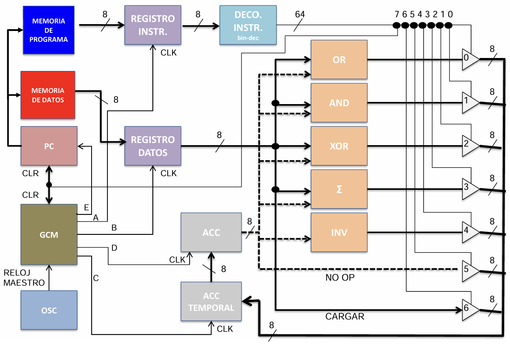

## **Módulo de los buffer tri estado**

Al ser un módulo sencillo, se empieza por describir en vhdl al componente, éste se encargará de que los submódulos que conformarán a la ALU se activen cuando sea correspondiente.

    library ieee;
    use ieee.std_logic_1164.all;

    entity buffer_TriState is
        port(
            ent: in std_logic_vector(7 downto 0);
            hab: in std_logic;
            sal: out std_logic_vector(7 downto 0)
        );
    end entity;

    architecture buff of buffer_TriState is
    begin

        sal <= ent when hab = '1' else (others => 'Z');

    end architecture;

## **Módulo del Oscilador (OSC)**

Este módulo generará los pulsos del reloj maestro del microprocesador, para adquirir la frecuencia base, se considerará el FPGA DE10-Lite de Terasic, que cuenta con un oscilador de cristal de cuarzo de 50 MHz. Se opta por obtener una frecuencia de salida de 1 kHz.

El divisor de frecuencia se muestra a continuación 

    library ieee;
    use ieee.std_logic_1164.all;

    entity OSC is
        port(
            clk      : in  std_logic;
            clk_1khz : out std_logic
        );
    end entity;

    architecture div of OSC is
        signal cont     : integer range 0 to 24999 := 0;
        signal clk_temp : std_logic := '0';
    begin
        process(clk)
        begin
            if rising_edge(clk) then
                if cont = 24999 then
                    cont <= 0;
                    clk_temp <= not clk_temp;
                else
                    cont <= cont + 1;
                end if;
            end if;
        end process;

        clk_1khz <= clk_temp;
    end div;

Donde el valor de 24999 se obtiene a partir de la frecuencia del FPGA y de la frecuencia deseada:

$$
f_{base} = 50 MHz
$$
$$
f_{deseada} = 1 KHz
$$
$$
N = \frac{f_{base}}{2 \times f_{deseada}} = \frac{50 MHz}{2 KHz} = 25000
$$

Puesto que el cero está implícito, la cuenta empieza desde cero y hasta 24999.

## **Módulo de la unidad de control (GCM)**

Para la implementación de la unidad de control, se muestra el diagrama de tiempos para el procesador a diseñar.

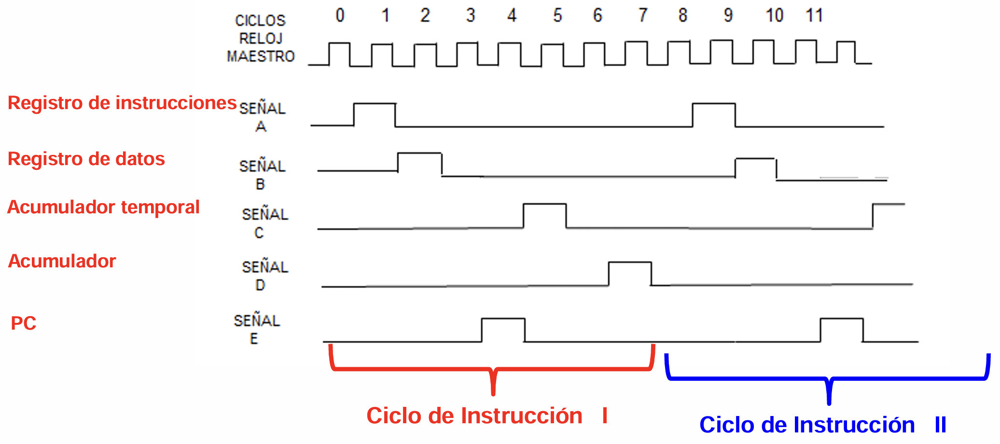

De acuerdo con la arquitectura del procesador, la unidad de control es sensible a las entradas de reloj (clk) y CLR (RST), y tiene cinco señales de salida. Para la construcción de este módulo se diseñará un circuito secuencial síncrono por medio de una carta ASM (máquina de estado algorítmico). La carta ASM tendrá la siguiente forma:

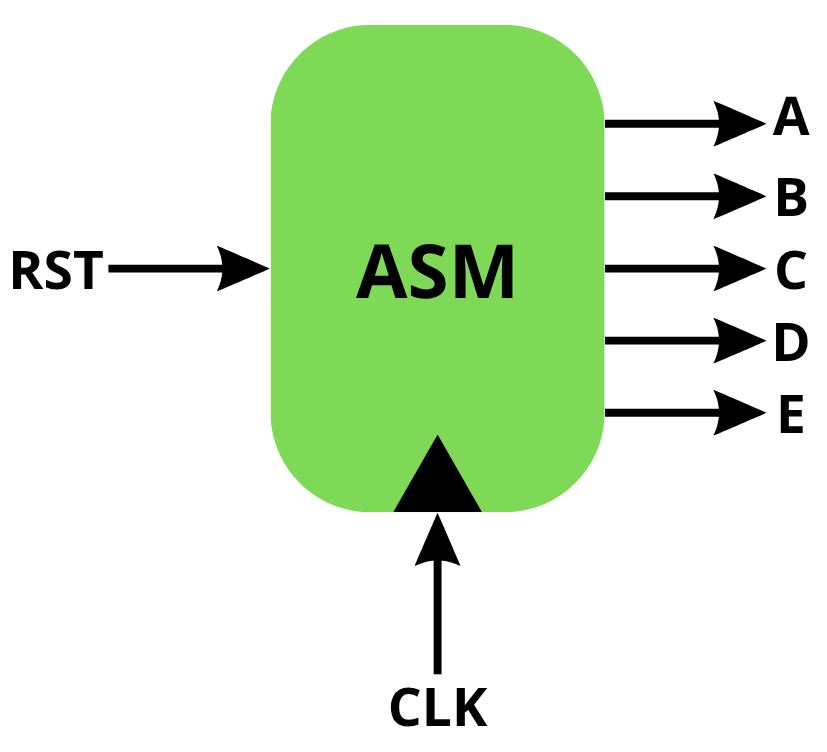

De acuerdo con el diagrama de tiempos, se pueden identificar los "pasos" a seguir y con ello se propone el siguiente diagrama de flujo "hablado":

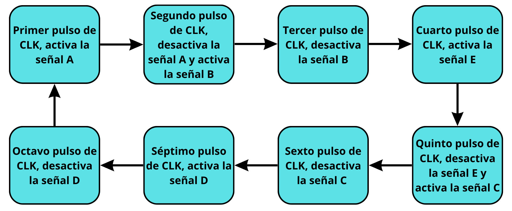

A partir del diagrama de flujo se desarrolla un diagrama de bloques del sistema que menciona el estado en el que se encuentre, el codificador para dicho estado y las salidas activas y desactivas.

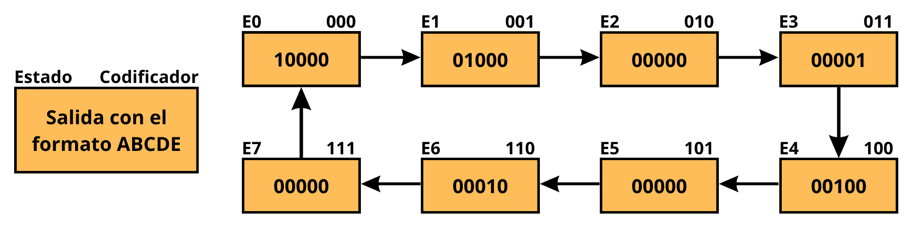

A partir del diagrama de bloques se puede contruir la tabla de estados presentes y futuros, junto con las salidas para cada señal, su valor en hexadecimal e identificadores para realizar la selección de cada palabra que se implementará con una memoria ROM.

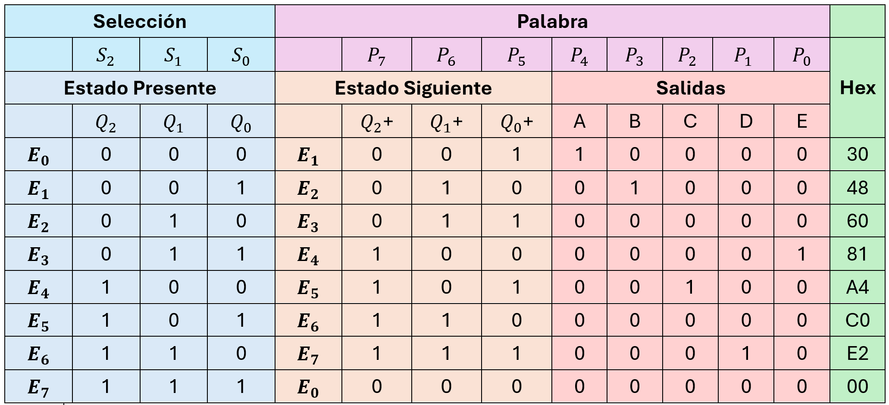

A partir de la tabla de estados se puede construir el circuito secuencial con una memoria ROM y 3 Flip Flop's tipo D, cuyas entradas son clk y rst y las salidas son las señales A, B, C, D y E. Se muestra una propuesta de la implementación del circuito.

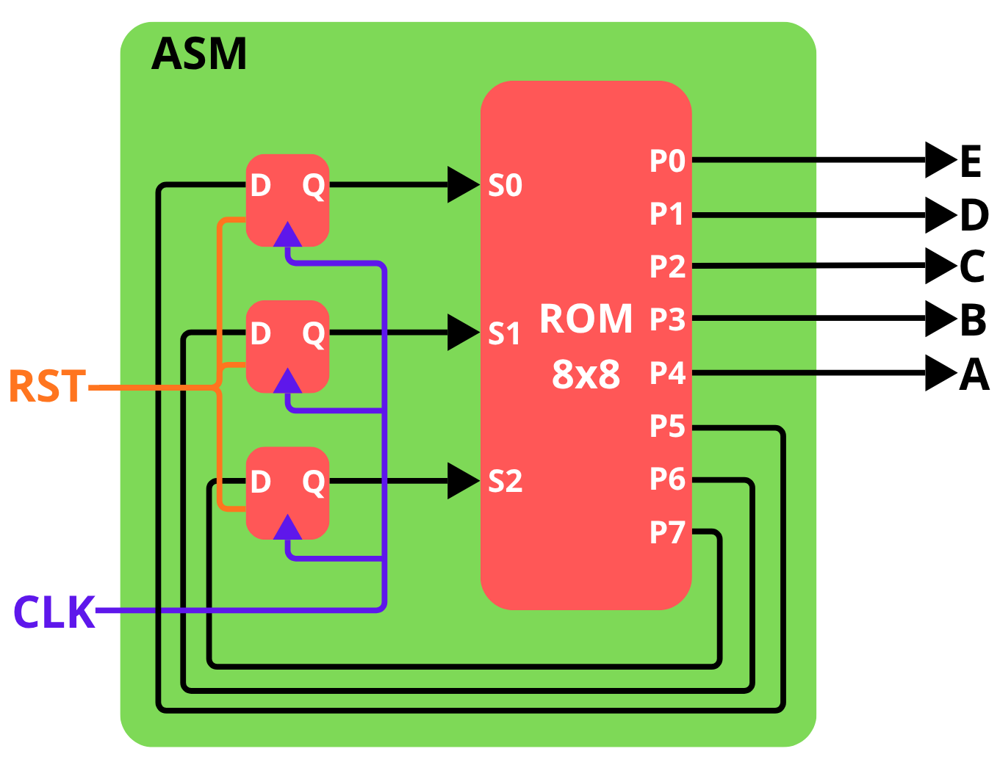

Se implementa en SimulIDE el circuito secuencial para corroborar su comportamiento con el solicitado en el diagrama de tiempos.

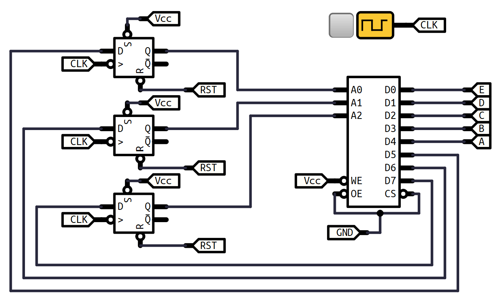

La memoria ROM de 8x8 se llena con los valores en hexadecimal de la tabla de estados.

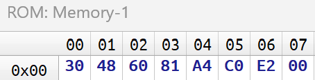

Al comprobar el comportamiento de las señales con el analizador lógico se obtiene el siguiente resultado:

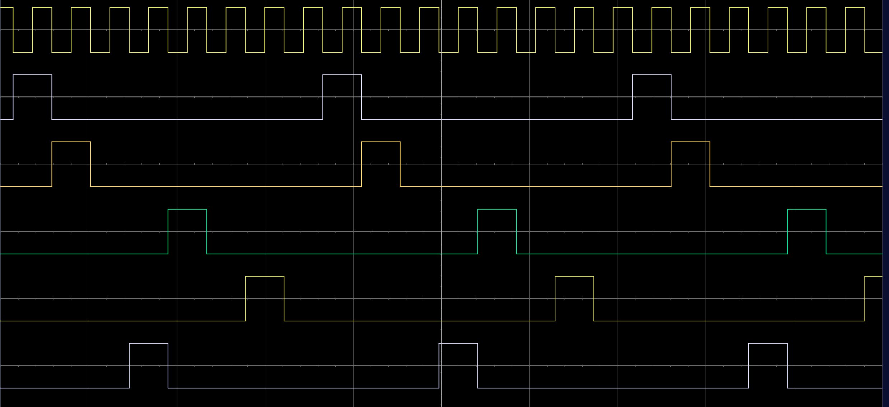

### **Flip Flop tipo D**

Se muestra la implementación del flip flop tipo D descrito en VHDL:

    library ieee;
    use ieee.std_logic_1164.all;

    entity FFd is
        port(
            clk,d,rst: in std_logic;
            q,qn: out std_logic
        );
    end entity;

    architecture ff of FFd is
        signal q_inter: std_logic := '0';
    begin
        process(clk,rst)
        begin
            if rst = '1' then
                q_inter <= '0';
            elsif 
                falling_edge(clk) then
                    q_inter <= d;
            end if;
        end process;
        
        q <= q_inter;
        qn <= not q_inter;
                    
    end architecture;

### **ROM para la GCM**

Se realiza la descripción en VHDL de la memoria implementada para la carta ASM:

    library ieee;
    use ieee.std_logic_1164.all;
    use ieee.numeric_std.all;

    entity rom_gcm is
        generic(
            data_width : integer := 8;
            addr_width : integer := 3;
            mem_depth  : integer := 8
        );
        port(
            sel     : in  std_logic_vector(addr_width-1 downto 0);
            palabra : out std_logic_vector(data_width-1 downto 0)
        );
    end rom_gcm;

    architecture rtl of rom_gcm is
        type datos is array(0 to mem_depth-1) of std_logic_vector(data_width-1 downto 0);
        constant memoria: datos := (
            0 => x"30",  -- E0
            1 => x"48",  -- E1
            2 => x"60",  -- E2
            3 => x"81",  -- E3
            4 => x"A4",  -- E4
            5 => x"C0",  -- E5
            6 => x"E2",  -- E6
            7 => x"00"   -- E7
        );
    begin

        palabra <= memoria(to_integer(unsigned(sel)));

    end rtl;

Una vez implementados los flip flops y la memoria de la carta ASM, se pueden estructurar ambos para realizar la unidad de control del módulo GCM.

    library ieee;
    use ieee.std_logic_1164.all;

    entity GCM is
        port(
            clk, rst : in  std_logic;
            P        : out std_logic_vector(4 downto 0)
        );
    end entity;

    architecture CU of GCM is

        -- Declaración de componentes
        component FFd is
            port(
                clk, d, rst : in  std_logic;
                q, qn       : out std_logic
            );
        end component;

        component rom_gcm is
            generic(
                data_width : integer := 8;
                addr_width : integer := 3;
                mem_depth  : integer := 8
            );
            port(
                sel     : in  std_logic_vector(addr_width-1 downto 0);
                palabra : out std_logic_vector(data_width-1 downto 0)
            );
        end component;

        -- Señales internas
        signal S       : std_logic_vector(2 downto 0);  -- estado actual (S2 S1 S0) = dirección de la ROM
        signal palabra : std_logic_vector(7 downto 0);  -- salida de 8 bits de la ROM (P7..P0)

    begin

        -- ROM de la ASM (8 palabras x 8 bits)
        ROM_ASM : rom_gcm
            generic map(
                data_width => 8,
                addr_width => 3,
                mem_depth  => 8
            )
            port map(
                sel     => S,
                palabra => palabra
            );

        -- FF de S0: entrada = P5 (Q0+), salida = S(0)
        FF_S0 : FFd
            port map(
                clk => clk,
                d   => palabra(5),
                rst => rst,
                q   => S(0),
                qn  => open
            );

        -- FF de S1: entrada = P6 (Q1+), salida = S(1)
        FF_S1 : FFd
            port map(
                clk => clk,
                d   => palabra(6),
                rst => rst,
                q   => S(1),
                qn  => open
            );

        -- FF de S2: entrada = P7 (Q2+), salida = S(2)
        FF_S2 : FFd
            port map(
                clk => clk,
                d   => palabra(7),
                rst => rst,
                q   => S(2),
                qn  => open
            );

        -- Salidas de control A,B,C,D,E = P4..P0 directo de la ROM
        P <= palabra(4 downto 0);

    end architecture;

Al realizar la simulación del módulo GCM, se obtiene el comportamiento de las señales solicitadas según el diagrama de tiempos. Las señales observadas son:
- **P[4]** -> señal A
- **P[3]** -> señal B
- **P[2]** -> señal C
- **P[1]** -> señal D
- **P[0]** -> señal E

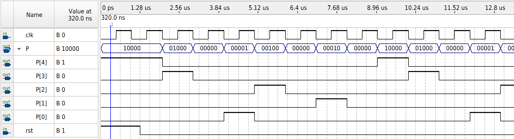

## **Módulo para el contador de programa (PC)**

El contador de programa suma uno cada que la señal E se activa y mantiene la opción de resetear si esque también se le indica. Se implementa por medio de la unión de flip flops tipo D, en paralelo, y el diagrama lógico se ejemplifica a continuación.

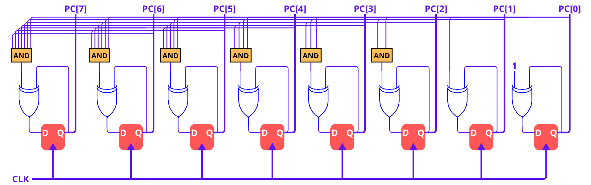

    library ieee;
    use ieee.std_logic_1164.all;
    use ieee.numeric_std.all;

    entity PC is
        generic(
            WIDTH : integer := 8  -- ancho del bus
        );
        port(
            clk, rst, signal_E : in  std_logic;
            direccion_mem       : out std_logic_vector(WIDTH-1 downto 0)
        );
    end entity;

    architecture struct of PC is
        
        component FFd is
            port(
                clk, d, rst: in std_logic;
                q, qn: out std_logic
            );
        end component;
        
        -- Señales para FFs
        signal d_ff  : std_logic_vector(WIDTH-1 downto 0);
        signal q_ff  : std_logic_vector(WIDTH-1 downto 0);
        signal qn_ff : std_logic_vector(WIDTH-1 downto 0);
        
        -- Carry de incremento
        signal carry : std_logic_vector(WIDTH downto 0);
        
    begin
        
        -- Generador de FFs
        gen_ffs: for i in 0 to WIDTH-1 generate
            ff_i: FFd port map(
                clk => clk,
                d   => d_ff(i),
                rst => rst,
                q   => q_ff(i),
                qn  => qn_ff(i)
            );
        end generate;
        
        carry(0) <= signal_E;
        
        gen_logic: for i in 0 to WIDTH-1 generate
            d_ff(i)     <= q_ff(i) XOR carry(i);
            carry(i+1)  <= carry(i) AND q_ff(i);
        end generate;
        
        direccion_mem <= q_ff;
        
    end architecture;

El comportamiento del contador se visualiza en el simulador con el nombre **pc_dbg** para corroborar su comportamiento hasta un reset que se aplica.

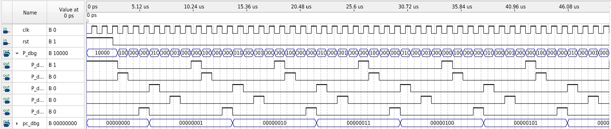

## **Memoria de programa y de instrucciones**

### **Memoria de programa (ROM_INSTRUCCIONES)**

La memoria de instrucciones se implementa como una memoria ROM con valores inicializados, estos valores corresponden por ahora al orden que tendrán las operaciones en la ALU, carga para el cumulador temporal o resetar. La inicialización de esta memoria se podrá modificar (programar) posteriormente según se requiera la aplicación.

    library ieee;
    use ieee.std_logic_1164.all;
    use ieee.numeric_std.all;

    entity ROM_INSTRUCCIONES is
        generic(
            addr_width: integer := 8;    -- ancho en bits del bus de direcciones
            data_width: integer := 8;    -- ancho en bits de cada palabra
            mem_depth:  integer := 256   -- número real de palabras = 2^addr_width
        );
    port(
            pc: in std_logic_vector(addr_width-1 downto 0);
        palabra: out std_logic_vector(data_width-1 downto 0)
    );
    end entity;

    architecture rominstrucciones of ROM_INSTRUCCIONES is
        type datos is array(0 to mem_depth-1) of std_logic_vector(data_width-1 downto 0);
        constant memoria: datos := (
    --        0  => x"00",  -- OR
    --        1  => x"01",  -- AND
    --        2  => x"02",  -- XOR
    --        3  => x"03",  -- SUM
    --        4  => x"04",  -- INV
    --        5  => x"05",  -- NO OPERAR
    --        6  => x"06",  -- CARGAR
    --        7  => x"07",  -- RESTA
    --        8  => x"08",  -- RECORRER IZQUIERDA
    --		    9  => x"09",  -- RESETEAR
    --		    10 => x"0A",  -- CARGAR VALOR DE ACC EN REGISTRO DE PROPOSITO GENERAL
    --			 11 => x"0B",  --CARGAR EL VALOR DEL RPG EN ACC
            0 => x"06", --cargar
            1 => x"08", --recorr izqu
            2 => x"07", --resta
            3 => x"04", --invertir
            4 => x"01", --and
            5 => x"02", --xor
            6 => x"03", --suma
            7 => x"00", --or
            8 => x"06", --cargar
            9 => x"05", --no operar 
            10 => x"08", --recorrer izq
            11 => x"07", --restar
            12 => x"06", --cargar
            13 => x"0A", -- cargar valor de acc en GPR
            14 => x"06", --cargar
            15 => x"0B", --cargar valor de GPR en acc
            16 => x"09", --resetear
            others => x"00"  -- resto de las posiciones en 0
        );
        
    begin

        palabra <= memoria(to_integer(unsigned(pc)));

    end architecture;

### **Memoria de datos (ROM_DATOS)**

Es similar a la memoria de instrucciones, salvo que en esta memoria se tendrán los valores de los operadores en hexadecimal, donde cada valor se comenta su valor en decimal.

    library ieee;
    use ieee.std_logic_1164.all;
    use ieee.numeric_std.all;

    entity ROM_DATOS is
        generic(
            addr_width: integer := 8;    -- ancho en bits del bus de direcciones
            data_width: integer := 8;    -- ancho en bits de cada palabra
            mem_depth:  integer := 256   -- número real de palabras = 2^addr_width
        );
    port(
            pc: in std_logic_vector(addr_width-1 downto 0);
        palabra: out std_logic_vector(data_width-1 downto 0)
    );
    end entity;

    architecture romdatos of ROM_DATOS is
        type datos is array(0 to mem_depth-1) of std_logic_vector(data_width-1 downto 0);
        constant memoria: datos := (
            0 => x"99",
            1 => x"03",
            2 => x"C0",
            3 => x"00", 
            4 => x"55",
            5 => x"AA",
            6 => x"01",
            7 => x"69",
            8 => x"FF",
            9 => x"00",
            10 => x"04",
            11 => x"F0",
            12 => x"77",
            13 => x"00",
            14 => x"AA",
            15 => x"00",
            16 => x"00",
            others => x"00"  -- resto de las posiciones en 0
        );
        
    begin

        palabra <= memoria(to_integer(unsigned(pc)));

    end architecture;

Ambas memorias reciben como entrada la salida del contador de programa (PC) que es el que va accediendo a cada fila de las memorias. Se procede a realizar la simulación considerando ambas memorias con los datos inicializados en cada una. La memoria de instrucciones se visualiza con valor en decimal llamado **instr_dbg**, mientras que la memoria de datos se visualiza con su valor en hexadecimal y con nombre **dato_dbg**.

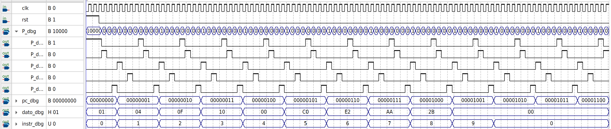

## **Registros**

### **Registros de instrucciones**

A continuación se implementa el registro de instrucciones que guarda el valor correspondiente de la memoria de instrucciones.

    library ieee;
    use ieee.std_logic_1164.all;

    entity Registro_Instr is
        port(
            clk, signal_A: in std_logic;
            palabra_mem_prog: in std_logic_vector(7 downto 0);
            sal_deco_instr: out std_logic_vector(7 downto 0) := (others => '0')
        );
    end entity;

    architecture reginstr of Registro_Instr is
    begin

        process(clk)
        begin
            if falling_edge(clk) then
                if signal_A = '1' then
                    sal_deco_instr <= palabra_mem_prog;
                end if;
            end if;
        end process;

    end architecture;

Se muestra el resultado de la simulación, donde el registro de instrucciones se llama **ri_dbg**, en la simulación se aprecia que este registro se escribe cada vez que la señal A llega a un flanco de bajada. El valor que se escribe en este registro corresponde al valor que se encuentra en la memoria de programa al que PC apunta.

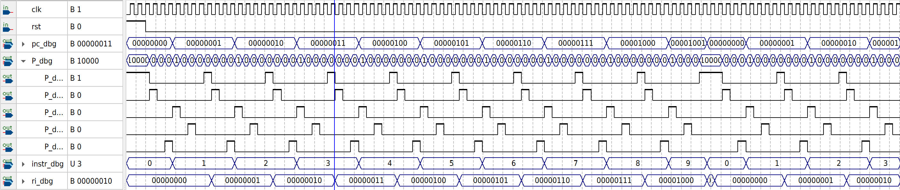

### **Registros de datos**

A continuación se implementa el registro de datos que guarda el valor correspondiente de la memoria de la memoria de datos.

    library ieee;
    use ieee.std_logic_1164.all;

    entity Registro_Datos is
        port(
            clk, signal_B: in std_logic;
            dato_memoria: in std_logic_vector(7 downto 0);
            sal_alu_dato: out std_logic_vector(7 downto 0) := (others => '0')
        );
    end entity;

    architecture regidat of Registro_Datos is
    begin
        process(clk)
        begin
            if falling_edge(clk) then
                if signal_B = '1' then
                    sal_alu_dato <= dato_memoria;
                end if;
            end if;
        end process;

    end architecture;

En la simulación se aprecia que registro de datos se escribe cada que la señal B tiene un flanco de bajada, el valor en simulación del registro de datos se llama **rd_dbg**, y adquiere el valor a la que PC apunte en la memoria de datos.

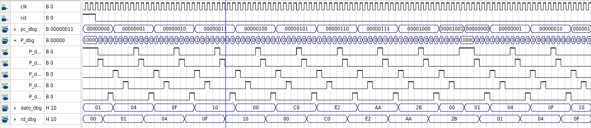

### **Registro de propósito general**

Se implementa un registro de propósito general, que estará dentro de la ALU; la memoria de instrucciones tendrá su propio valor para determinar si el acumulador (ACC) le pasará su valor al registro de propósito general (ALU_REG_PROP_GEN) o si el registro de propósito general será quien le pase su valor al acumulador. La forma del registro se muestra a continuación.

    library ieee;
    use ieee.std_logic_1164.all;

    entity ALU_REG_PROP_GEN is
        port(
            clk, signal_Deco_Inst: in std_logic;
            dato_acc: in std_logic_vector(7 downto 0);
            rpg_sal: out std_logic_vector(7 downto 0) := (others => '0')
        );
    end entity;

    architecture regipropgral of ALU_REG_PROP_GEN is
    begin
        process(clk)
        begin
            if falling_edge(clk) then
                if signal_Deco_Inst = '1' then
                    rpg_sal <= dato_acc;
                end if;
            end if;
        end process;

    end architecture;

## **Decodificador de instrucciones**

Para crear el decodificador de instrucciones, se procede a realizar su tablad e verdad según las entradas recibidas (bus de 8 datos) y las salidas que se desean activar a los buffer triestado para la ALU.

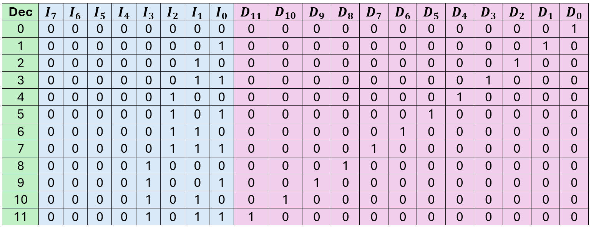

Se procede a realizar la descripción al nivel de compuertas lógicas, como sólo se ocupan los 4 bits menos significativos para poder determinar la salida deseada, los bits más significativos no se tomarán en cuenta para determinar las funciones booleanas.

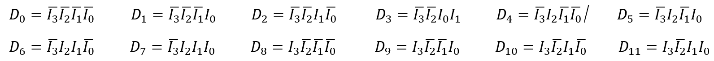

Se implementa en vhdl la descripción del decodificador de intrucciones cuya entrada es la del registro de instrucciones y sus salidas serán las que activen a los buffer triestado de la ALU.

    library ieee;
    use ieee.std_logic_1164.all;

    entity Decodificador_Instr is
        port(
            I: in std_logic_vector(7 downto 0);
            D: out std_logic_vector(11 downto 0)  -- habilitación por cada operación
        );
    end entity;

    architecture decoinstr of Decodificador_Instr is

    begin

        D(0)  <= not(I(3)) and not(I(2)) and not(I(1)) and not(I(0)); -- OR
        D(1)  <= not(I(3)) and not(I(2)) and not(I(1)) and I(0); -- AND
        D(2)  <= not(I(3)) and not(I(2)) and I(1) and not(I(0)); -- XOR
        D(3)  <= not(I(3)) and not(I(2)) and I(1) and I(0); -- Sum
        D(4)  <= not(I(3)) and I(2) and not(I(1)) and not(I(0)); -- Inv
        D(5)  <= not(I(3)) and I(2) and not(I(1)) and I(0); -- No operar
        D(6)  <= not(I(3)) and I(2) and I(1) and not(I(0)); -- Cargar
        D(7)  <= not(I(3)) and I(2) and I(1) and I(0); -- Restar
        D(8)  <= I(3) and not(I(2)) and not(I(1)) and not(I(0)); -- Recorrer a la izquierda
        D(9)  <= I(3) and not(I(2)) and not(I(1)) and I(0);	-- Resetear
        D(10) <= I(3) and not(I(2)) and I(1) and not(I(0));	-- Cargar ACC en GPR
        D(11) <= I(3) and not(I(2)) and I(1) and I(0); -- Cargar GPR en ACC

    end architecture;

En la simulación se ve que el decodificador va traducioendo los valores del registro de instrucciones de forma que se va activando un buffer que corresponderá a cada oepración de la ALU, cargar el valor o bien resetar. El valor definidio para resetear es x09, por lo que cuando se carga al decodificador de instrucciones el valor proveniente de la memoria de programa, dura un pulso de reloj para resetar al sistema y poner a la GCM en el estado cero, y al contador también en cero. El valor del decodificador de instrucciones en la simulación se denomina **buff_dbg**.

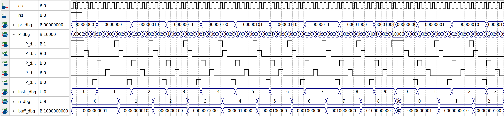

## **Acumuladores**

### **Acumulador temporal (ACC_TEMP)**

El acumulador temporal se describe en vhdl de la siguiente forma:

    library ieee;
    use ieee.std_logic_1164.all;

    entity ACC_TEMP is
        port(
            clk, signal_C: in std_logic;
            res_ALU: in std_logic_vector(7 downto 0);
            sal_ACC_TEMP: out std_logic_vector(7 downto 0) := (others => '0')
        );
    end entity;

    architecture acctemp of ACC_TEMP is
        begin
            process(clk)
                begin
                    if falling_edge(clk) then
                        if signal_C = '1' then
                            sal_ACC_TEMP <= res_ALU;
                        end if;
                    end if;
            end process;
    end architecture;

Donde recibe como entrada la salida de resultado de la ALU, que se almacena cada que la señal C se activa y su salida es mandada al próximo acumulador llamado ACC.

### **Acumulador (ACC)**

Este acumulador recibe como entrada la salida del acumulador temporal y se almacena cada que la señal D se activa; su salida es una de los operandos que se pueden usar en la ALU. Como al acumulador podrá guardar el valor desde dos lugares (desde el acumulador temporal o desde el registro de propósito general) su entrada tendrá de datos tendrá ahora un multiplexor que determinará que valor será el que se guarde en el acumulador. 

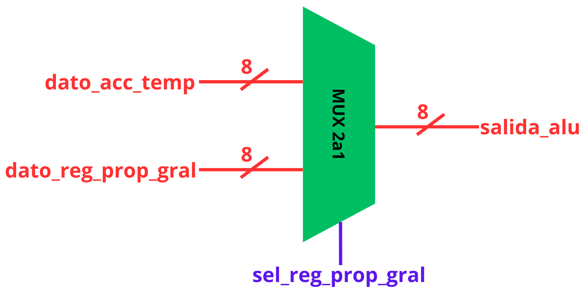

Está descrito en VHDL de la siguiente forma. 

    library ieee;
    use ieee.std_logic_1164.all;

    entity ACC is
        port(
            clk, signal_D, sel_gpr : in std_logic;
            val_acc_temp, val_reg_prop_gen : in std_logic_vector(7 downto 0);
            sal_alu_acc : out std_logic_vector(7 downto 0) := (others => '0')
        );
    end entity;

    architecture acumu of ACC is

        signal dato_mux : std_logic_vector(7 downto 0);

    begin

        -- Selección combinacional de la fuente de datos:
        -- si sel_gpr='1', carga el valor de GPR; si no, el resultado proviene de ACC_TEMP
        dato_mux <= val_reg_prop_gen when sel_gpr = '1' else val_acc_temp;

        process(clk)
        begin
            if falling_edge(clk) then
                if signal_D = '1' then
                    sal_alu_acc <= dato_mux;
                end if;
            end if;
        end process;

    end architecture;

## **Unidad aritmética lógica (ALU)**

Para el diseño de la ALU, se realizó cada submódulo para al final integrar todo por submódulos en un archivo de vhdl que describiera a la ALU en general.

### **OR**

    library ieee;
    use ieee.std_logic_1164.all;

    entity ALU_OR is
        port(
            acc,dato: in std_logic_vector(7 downto 0);
            acc_temp: out std_logic_vector(7 downto 0)
        );
    end entity;

    architecture aluor of ALU_OR is
    begin

        acc_temp <= acc OR dato;
        
    end architecture;

### **AND**

    library ieee;
    use ieee.std_logic_1164.all;

    entity ALU_AND is
        port(
            acc,dato: in std_logic_vector(7 downto 0);
            acc_temp: out std_logic_vector(7 downto 0)
        );
    end entity;

    architecture aluand of ALU_AND is
    begin

        acc_temp <= acc AND dato;
        
    end architecture;

### **XOR**

    library ieee;
    use ieee.std_logic_1164.all;

    entity ALU_XOR is
        port(
            acc,dato: in std_logic_vector(7 downto 0);
            acc_temp: out std_logic_vector(7 downto 0)
        );
    end entity;

    architecture aluxor of ALU_XOR is
    begin

        acc_temp <= acc XOR dato;
        
    end architecture;

### **SUM**

Para determinar la suma se implementa un medio sumador y siete sumadores completos como se muestra en la imagen.

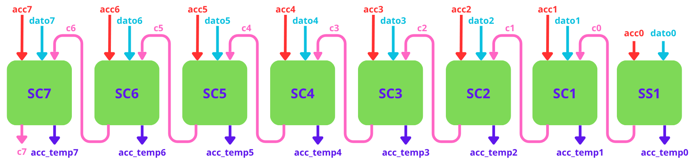

    library ieee;
    use ieee.std_logic_1164.all;
    use ieee.numeric_std.all;

    entity ALU_SUM is
        port(
            acc,dato: in std_logic_vector(7 downto 0);
            acc_temp: out std_logic_vector(7 downto 0);
            acc_temp_carry: out std_logic
        );
    end entity;

    architecture alusum of ALU_SUM is
        
        signal c: std_logic_vector(7 downto 0);

    begin

        -- Semi sumador SS0
        c(0) <= acc(0) and dato(0);
        acc_temp(0) <= acc(0) xor dato(0);
        
        -- Sumador completo SC1
        c(1) <= (acc(1) and dato(1)) or (acc(1) and c(0)) or (dato(1) and c(0));
        acc_temp(1) <= acc(1) xor dato(1) xor c(0);
        
        -- Sumador completo SC2
        c(2) <= (acc(2) and dato(2)) or (acc(2) and c(1)) or (dato(2) and c(1));
        acc_temp(2) <= acc(2) xor dato(2) xor c(1);
        
        -- Sumador completo SC3
        c(3) <= (acc(3) and dato(3)) or (acc(3) and c(2)) or (dato(3) and c(2));
        acc_temp(3) <= acc(3) xor dato(3) xor c(2);
        
        -- Sumador completo SC4
        c(4) <= (acc(4) and dato(4)) or (acc(4) and c(3)) or (dato(4) and c(3));
        acc_temp(4) <= acc(4) xor dato(4) xor c(3);
        
        -- Sumador completo SC5
        c(5) <= (acc(5) and dato(5)) or (acc(5) and c(4)) or (dato(5) and c(4));
        acc_temp(5) <= acc(5) xor dato(5) xor c(4);
        
        -- Sumador completo SC6
        c(6) <= (acc(6) and dato(6)) or (acc(6) and c(5)) or (dato(6) and c(5));
        acc_temp(6) <= acc(6) xor dato(6) xor c(5);
        
        -- Sumador completo SC7
        c(7) <= (acc(7) and dato(7)) or (acc(7) and c(6)) or (dato(7) and c(6));
        acc_temp(7) <= acc(7) xor dato(7) xor c(6);
        
        -- Carry de salida (acarreo final)
        acc_temp_carry <= c(7);
        
    end architecture;

### **INV**

    library ieee;
    use ieee.std_logic_1164.all;

    entity ALU_INV is
        port(
            acc: in std_logic_vector(7 downto 0);
            acc_temp: out std_logic_vector(7 downto 0)
        );
    end entity;

    architecture aluinv of ALU_INV is
    begin

        acc_temp <= NOT acc;
        
    end architecture;

### **No operar**

    library ieee;
    use ieee.std_logic_1164.all;

    entity ALU_NO_OP is
        port(
            acc: in std_logic_vector(7 downto 0);
            acc_temp: out std_logic_vector(7 downto 0)
        );
    end entity;

    architecture alunop of ALU_NO_OP is
    begin

        acc_temp <= acc;

    end architecture;

### **Cargar valor**

    library ieee;
    use ieee.std_logic_1164.all;

    entity ALU_CARGA is
        port(
            dato: in std_logic_vector(7 downto 0);
            acc_temp: out std_logic_vector(7 downto 0)
        );
    end entity;

    architecture alucarga of ALU_CARGA is
    begin

        acc_temp <= dato;  --pasa el dato inmediato a la salida

    end architecture;

### **Resta A2**

A partir de la suma, la resta con complemento A2 se puede determinar análogamente; invirtiendo el valor de dato (denotado como **dn_n**) y cambiando el primer semi sumador del sumador con un sumador completo, ya que se está sumando 1 por la definición de complemento A2.

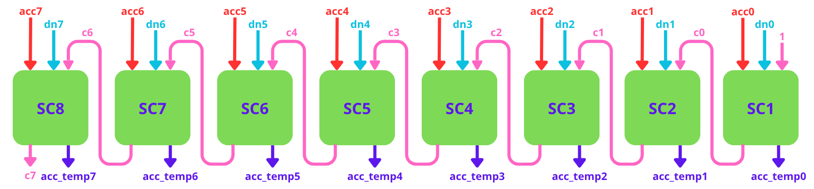

    library ieee;
    use ieee.std_logic_1164.all;
    use ieee.numeric_std.all;

    entity ALU_RESTA is
        port(
            acc,dato: in std_logic_vector(7 downto 0);
            acc_temp: out std_logic_vector(7 downto 0);
            acc_temp_carry: out std_logic
        );
    end entity;

    architecture aluresta of ALU_RESTA is
        
        signal c: std_logic_vector(7 downto 0);
        signal dato_inv: std_logic_vector(7 downto 0);

    begin

        -- Complemento a 1 de dato 
        dato_inv <= not dato;

        -- Sumador completo SC0 (carry de entrada fijo en '1' → el "+1" del complemento a 2)
        c(0) <= (acc(0) and dato_inv(0)) or (acc(0) and '1') or (dato_inv(0) and '1');
        acc_temp(0) <= acc(0) xor dato_inv(0) xor '1';
        
        -- Sumador completo SC1
        c(1) <= (acc(1) and dato_inv(1)) or (acc(1) and c(0)) or (dato_inv(1) and c(0));
        acc_temp(1) <= acc(1) xor dato_inv(1) xor c(0);
        
        -- Sumador completo SC2
        c(2) <= (acc(2) and dato_inv(2)) or (acc(2) and c(1)) or (dato_inv(2) and c(1));
        acc_temp(2) <= acc(2) xor dato_inv(2) xor c(1);
        
        -- Sumador completo SC3
        c(3) <= (acc(3) and dato_inv(3)) or (acc(3) and c(2)) or (dato_inv(3) and c(2));
        acc_temp(3) <= acc(3) xor dato_inv(3) xor c(2);
        
        -- Sumador completo SC4
        c(4) <= (acc(4) and dato_inv(4)) or (acc(4) and c(3)) or (dato_inv(4) and c(3));
        acc_temp(4) <= acc(4) xor dato_inv(4) xor c(3);
        
        -- Sumador completo SC5
        c(5) <= (acc(5) and dato_inv(5)) or (acc(5) and c(4)) or (dato_inv(5) and c(4));
        acc_temp(5) <= acc(5) xor dato_inv(5) xor c(4);
        
        -- Sumador completo SC6
        c(6) <= (acc(6) and dato_inv(6)) or (acc(6) and c(5)) or (dato_inv(6) and c(5));
        acc_temp(6) <= acc(6) xor dato_inv(6) xor c(5);
        
        -- Sumador completo SC7
        c(7) <= (acc(7) and dato_inv(7)) or (acc(7) and c(6)) or (dato_inv(7) and c(6));
        acc_temp(7) <= acc(7) xor dato_inv(7) xor c(6);
        
        -- Carry de salida
        acc_temp_carry <= c(7);
        
    end architecture;

### **Recorrer a la izquierda**

Se realiza el estudio para poder realizar el recorrido a la izquierda de n bits, donde n corresponde al valor que dato tenga (desde 0 a 7, ya que por arriba de eso, el valor de acc será siempre 00000000).

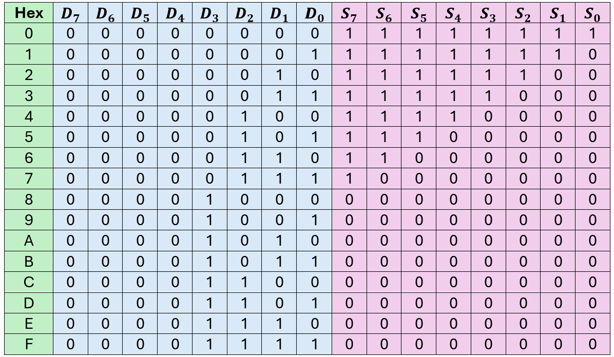

Teniendo la tabla, se procede a realizar a obtener las funciones booleanas de cada salida, donde las entradas corresponden únicamente a los 4 bits más significativos, ya que son los que realmente efectuarán el cambio en el recorrido.

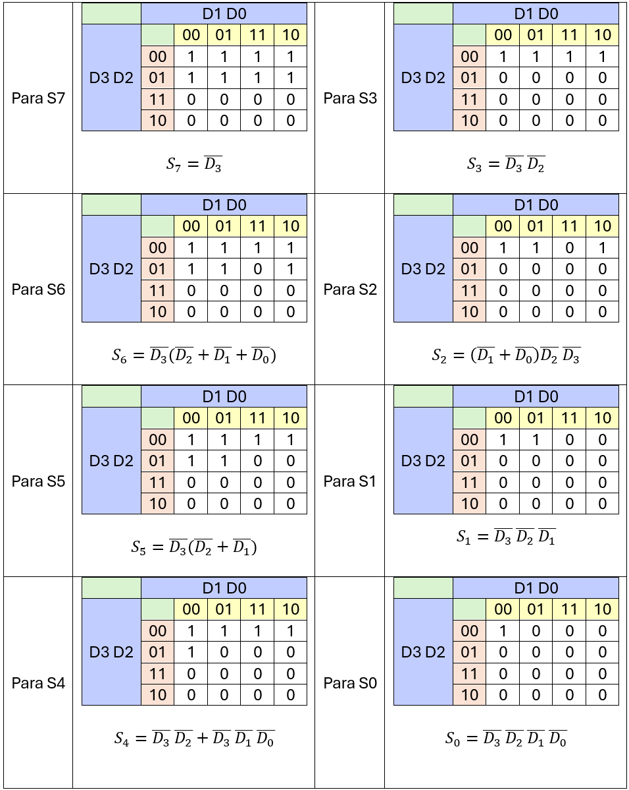

Se procede a describir el hardware en vhdl según el desplazamiento que se requiere.

    library ieee;
    use ieee.std_logic_1164.all;
    use ieee.numeric_std.all;

    entity ALU_REC_IZQ is
        port(
            acc, dato: in std_logic_vector(7 downto 0);
            acc_temp: out std_logic_vector(7 downto 0)
        );
    end entity;

    architecture alurecizq of ALU_REC_IZQ is

        signal s: std_logic_vector(7 downto 0);
        signal e: std_logic_vector(7 downto 0);
        
    begin
        
        s(7) <= not(dato(3));
        s(6) <= not(dato(3)) and (not(dato(2)) or not(dato(1)) or not(dato(0)));
        s(5) <= not(dato(3)) and (not(dato(2)) or not(dato(1)));
        s(4) <= (not(dato(3)) and not(dato(2))) or (not(dato(3)) and not(dato(1)) and not(dato(0)));
        s(3) <= not(dato(3)) and not(dato(2));
        s(2) <= (not(dato(1)) or not(dato(0))) and not(dato(2)) and not(dato(3));
        s(1) <= not(dato(3)) and not(dato(2)) and not(dato(1));
        s(0) <= not(dato(3)) and not(dato(2)) and not(dato(1)) and not(dato(0));
        
        e(0) <= s(0);
        e(1) <= s(1) and not(s(0));
        e(2) <= s(2) and not(s(1));
        e(3) <= s(3) and not(s(2));
        e(4) <= s(4) and not(s(3));
        e(5) <= s(5) and not(s(4));
        e(6) <= s(6) and not(s(5));
        e(7) <= s(7) and not(s(6));
        
        acc_temp(0) <= e(0) and acc(0);
        acc_temp(1) <= (e(0) and acc(1)) or (e(1) and acc(0));
        acc_temp(2) <= (e(0) and acc(2)) or (e(1) and acc(1)) or (e(2) and acc(0));
        acc_temp(3) <= (e(0) and acc(3)) or (e(1) and acc(2)) or (e(2) and acc(1)) or (e(3) and acc(0));
        acc_temp(4) <= (e(0) and acc(4)) or (e(1) and acc(3)) or (e(2) and acc(2)) or (e(3) and acc(1)) or (e(4) and acc(0));
        acc_temp(5) <= (e(0) and acc(5)) or (e(1) and acc(4)) or (e(2) and acc(3)) or (e(3) and acc(2)) or (e(4) and acc(1)) or (e(5) and acc(0));
        acc_temp(6) <= (e(0) and acc(6)) or (e(1) and acc(5)) or (e(2) and acc(4)) or (e(3) and acc(3)) or (e(4) and acc(2)) or (e(5) and acc(1)) or (e(6) and acc(0));
        acc_temp(7) <= (e(0) and acc(7)) or (e(1) and acc(6)) or (e(2) and acc(5)) or (e(3) and acc(4)) or (e(4) and acc(3)) or (e(5) and acc(2)) or (e(6) and acc(1)) or (e(7) and acc(0));
        
    end architecture;

### **ALU integrada**

Una vez con todos los módulos descritos, se procede a realizar la descripción de la ALU completa con todos los módulos definidos.

    library ieee;
    use ieee.std_logic_1164.all;

    entity Microprocesador is
        port(
            clk, rst : in std_logic;
            -- (aquí irán después los demás puertos externos)

            -- Salidas temporales de depuración (quitar cuando el diseño esté completo)
            P_dbg        : out std_logic_vector(4 downto 0);
            pc_dbg       : out std_logic_vector(7 downto 0);
            instr_dbg    : out std_logic_vector(7 downto 0);
            dato_dbg     : out std_logic_vector(7 downto 0);
            ri_dbg       : out std_logic_vector(7 downto 0);
            rd_dbg       : out std_logic_vector(7 downto 0);
            buff_dbg     : out std_logic_vector(11 downto 0);
            res_alu_dbg  : out std_logic_vector(7 downto 0);
            acctemp_dbg  : out std_logic_vector(7 downto 0);
            acc_dbg      : out std_logic_vector(7 downto 0);
            gpr_dbg      : out std_logic_vector(7 downto 0)
        );
    end entity;

    architecture top of Microprocesador is

        component GCM is
            port(
                clk, rst : in  std_logic;
                P        : out std_logic_vector(4 downto 0)
            );
        end component;

        component PC is
            generic(
                WIDTH : integer := 8
            );
            port(
                clk, rst, signal_E : in  std_logic;
                direccion_mem       : out std_logic_vector(WIDTH-1 downto 0)
            );
        end component;

        component ROM_INSTRUCCIONES is
            generic(
                addr_width: integer := 8;
                data_width: integer := 8;
                mem_depth:  integer := 256
            );
            port(
                pc      : in  std_logic_vector(addr_width-1 downto 0);
                palabra : out std_logic_vector(data_width-1 downto 0)
            );
        end component;

        component ROM_DATOS is
            generic(
                addr_width: integer := 8;
                data_width: integer := 8;
                mem_depth:  integer := 256
            );
            port(
                pc      : in  std_logic_vector(addr_width-1 downto 0);
                palabra : out std_logic_vector(data_width-1 downto 0)
            );
        end component;

        component Registro_Instr is
            port(
                clk, signal_A    : in  std_logic;
                palabra_mem_prog : in  std_logic_vector(7 downto 0);
                sal_deco_instr   : out std_logic_vector(7 downto 0)
            );
        end component;

        component Registro_Datos is
            port(
                clk, signal_B : in  std_logic;
                dato_memoria  : in  std_logic_vector(7 downto 0);
                sal_alu_dato  : out std_logic_vector(7 downto 0)
            );
        end component;

        component Decodificador_Instr is
            port(
                I : in  std_logic_vector(7 downto 0);
                D  : out std_logic_vector(11 downto 0)
            );
        end component;

        component ACC_TEMP is
            port(
                clk, signal_C : in  std_logic;
                res_ALU       : in  std_logic_vector(7 downto 0);
                sal_ACC_TEMP  : out std_logic_vector(7 downto 0)
            );
        end component;

        component ACC is
            port(
                clk, signal_D, sel_gpr          : in  std_logic;
                val_acc_temp, val_reg_prop_gen  : in  std_logic_vector(7 downto 0);
                sal_alu_acc                     : out std_logic_vector(7 downto 0)
            );
        end component;

        component ALU is
            port(
                acc, dato: in std_logic_vector(7 downto 0);
                hab_or, hab_and, hab_xor, hab_sum, hab_inv,
                hab_noop, hab_carga, hab_resta, hab_recizq: in std_logic;
                acc_temp: out std_logic_vector(7 downto 0)
            );
        end component;

        component ALU_REG_PROP_GEN is
            port(
                clk, signal_Deco_Inst : in  std_logic;
                dato_acc              : in  std_logic_vector(7 downto 0);
                rpg_sal               : out std_logic_vector(7 downto 0)
            );
        end component;

        signal P_gcm       : std_logic_vector(4 downto 0);
        signal addr_pc     : std_logic_vector(7 downto 0);
        signal instr_word  : std_logic_vector(7 downto 0);
        signal dato_word   : std_logic_vector(7 downto 0);
        signal ri_word     : std_logic_vector(7 downto 0);
        signal rd_word     : std_logic_vector(7 downto 0);
        signal buff_word   : std_logic_vector(11 downto 0);
        signal rst_total   : std_logic;
        signal acctemp_word: std_logic_vector(7 downto 0);
        signal acc_word    : std_logic_vector(7 downto 0);
        signal res_alu_word: std_logic_vector(7 downto 0);
        signal gpr_word    : std_logic_vector(7 downto 0);

    begin

        GCM_inst : GCM
            port map(
                clk => clk,
                rst => rst_total,
                P   => P_gcm
            );

        PC_inst : PC
            generic map(
                WIDTH => 8
            )
            port map(
                clk           => clk,
                rst           => rst_total,
                signal_E      => P_gcm(0),
                direccion_mem => addr_pc
            );

        -- Memoria de instrucciones: direccionada por el PC
        ROM_INSTR_inst : ROM_INSTRUCCIONES
            generic map(
                addr_width => 8,
                data_width => 8,
                mem_depth  => 256
            )
            port map(
                pc      => addr_pc,
                palabra => instr_word
            );

        -- Memoria de datos: direccionada también por el PC
        ROM_DATOS_inst : ROM_DATOS
            generic map(
                addr_width => 8,
                data_width => 8,
                mem_depth  => 256
            )
            port map(
                pc      => addr_pc,
                palabra => dato_word
            );

        -- Registro de instrucciones: captura la palabra de la ROM de instrucciones
        -- cuando la GCM activa la señal A
        RI_inst : Registro_Instr
            port map(
                clk              => clk,
                signal_A         => P_gcm(4),
                palabra_mem_prog => instr_word,
                sal_deco_instr   => ri_word
            );

        -- Registro de datos: captura la palabra de la ROM de datos
        -- cuando la GCM activa la señal B
        RD_inst : Registro_Datos
            port map(
                clk          => clk,
                signal_B     => P_gcm(3),
                dato_memoria => dato_word,
                sal_alu_dato => rd_word
            );

        -- Decodificador de instrucciones: convierte el opcode capturado
        -- en las señales de habilitación de la ALU y de las operaciones especiales
        DECOD_inst : Decodificador_Instr
            port map(
                I => ri_word,
                D  => buff_word
            );

        -- ALU: recibe como operandos el acumulador (acc) y el registro de datos (dato),
        -- y las 9 señales de habilitación que vienen del decodificador de instrucciones
        ALU_inst : ALU
            port map(
                acc        => acc_word,
                dato       => rd_word,
                hab_or     => buff_word(0),
                hab_and    => buff_word(1),
                hab_xor    => buff_word(2),
                hab_sum    => buff_word(3),
                hab_inv    => buff_word(4),
                hab_noop   => buff_word(5),
                hab_carga  => buff_word(6),
                hab_resta  => buff_word(7),
                hab_recizq => buff_word(8),
                acc_temp   => res_alu_word
            );

        -- Acumulador temporal: captura el resultado real de la ALU
        -- cuando la GCM activa la señal C
        ACCTEMP_inst : ACC_TEMP
            port map(
                clk          => clk,
                signal_C     => P_gcm(2),
                res_ALU      => res_alu_word,
                sal_ACC_TEMP => acctemp_word
            );

        -- Registro de propósito general (GPR): captura el valor actual del
        -- acumulador cuando la instrucción decodificada es 0x0A (buff_word(10)).
        -- Se combina con signal_C (P_gcm(2)) para que la captura ocurra una
        -- sola vez por ciclo de instrucción, igual que ACC_TEMP con la ALU
        GPR_inst : ALU_REG_PROP_GEN
            port map(
                clk              => clk,
                signal_Deco_Inst => buff_word(10) and P_gcm(2),
                dato_acc         => acc_word,
                rpg_sal          => gpr_word
            );

        -- Acumulador: captura el valor de ACC_TEMP cuando la GCM activa la
        -- señal D. Si la instrucción decodificada es 0x0B (buff_word(11)),
        -- en su lugar carga el valor del registro de propósito general
        ACC_inst : ACC
                port map(
                    clk              => clk,
                    signal_D         => P_gcm(1) and (not buff_word(10)),  -- <-- único cambio
                    sel_gpr          => buff_word(11),
                    val_acc_temp     => acctemp_word,
                    val_reg_prop_gen => gpr_word,
                    sal_alu_acc      => acc_word
        );

        -- Conexión de las señales internas a las salidas de depuración
        P_dbg       <= P_gcm;
        pc_dbg      <= addr_pc;
        instr_dbg   <= instr_word;
        dato_dbg    <= dato_word;
        ri_dbg      <= ri_word;
        rd_dbg      <= rd_word;
        buff_dbg    <= buff_word;
        rst_total   <= rst OR buff_word(9);
        res_alu_dbg <= res_alu_word;
        acctemp_dbg <= acctemp_word;
        acc_dbg     <= acc_word;
        gpr_dbg     <= gpr_word;

    end architecture;

El diagrama de tiempos en resumen es:

- A: carga al registro de instrucciones lo que la memoria de programa tiene.
- B: carga al registro de datos lo que la memoria de datos tiene.
- C: almacena en acc_temporal el resultado de acc y del registro de datos según la operación del registro de instrucciones.
- D: almacena en acc el resultado de acc_temporal.
- E: aumenta en contador de programa.

Aplicación del microprocesador con un ejemplo:

0. Cargar el valor 99 (Ri_dbg : x06 ; Rd_dbg : x99)
   pc_dbg : 0
   acc_dbg: 1001 1001

1. Recorrer a la izquierda 3 posiciones (Ri_dbg : x08 ; Rd_dbg : x03)
   pc_dbg : 1
   acc_dbg: 1100 1000

2. Restar 12 (Ri_dbg : x07 ; Rd_dbg : xC0)
   pc_dbg : 2
   acc_dbg: 0000 1000 

3. Invertir (Ri_dbg : x04 ; Rd_dbg : x00)
   pc_dbg : 3
   acc_dbg: 1111 0111

4. And con 0x55 (Ri_dbg : x01 ; Rd_dbg : x55)
   pc_dbg : 4
   acc_dbg: 0101 0101

5. Xor con 0xAA (Ri_dbg : x02 ; Rd_dbg : xAA -1010-)
   pc_dbg : 5
   acc_dbg: 1111 1111

6. Sumar 1 (Ri_dbg : x03 ; Rd_dbg : x01)
   pc_dbg : 6
   acc_dbg: 0000 0000

7. Or con 0x69 (Ri_dbg : x00 ; Rd_dbg : x69)
   pc_dbg : 7
   acc_dbg: 0110 1001

8. Cargar el valor 0xFF (Ri_dbg : x06 ; Rd_dbg : xFF)
   pc_dbg : 8
   acc_dbg: 1111 1111

9.  No operar (Ri_dbg : x06 ; Rd_dbg : xFF)
    pc_dbg : 9
    acc_dbg : 1111 1111

10. Recorrer a la izquierda 4 posiciones (Ri_dbg : x08 ; Rd_dbg : x04)
    pc_dbg : 10
    acc_dbg : 1111 0000

11. Restar 0xF0 (Ri_dbg : x07 ; Rd_dbg : xF0)
    pc_dbg : 11
    acc_dbg : 0000 0000

12. Cargar el valor 0x77 (Ri_dbg : x06 ; Rd_dbg : x77)
    pc_dbg : 12
    acc_dbg : 0111 0111

13. Cargar el valor de acc en el registro de propósito general (Ri_dbg : x0A ; Rd_dbg : x00)
    pc_dbg : 13
    acc_dbg : 0111 0111
    gpr_dbg : 0111 0111

14. Cargar el valor 0xAA (Ri_dbg : x06 ; Rd_dbg : xAA)
    pc_dbg : 14
    acc_dbg : 1010 1010

15. Cargar el valor del registro de propósito general en acc
    pc_dbg : 15
    acc_dbg : 0111 0111

16. Resetear (Ri_dbg : x09 ; Rd_dbg : x00)
    pc_dbg : 16 -> 0

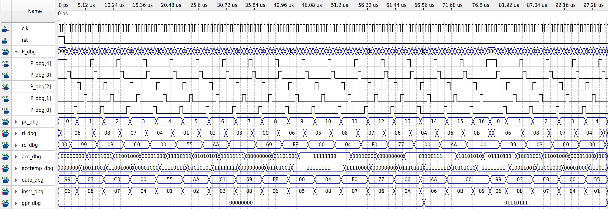

